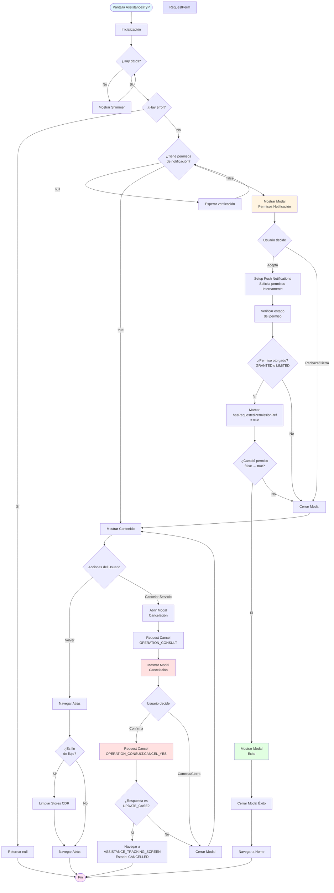
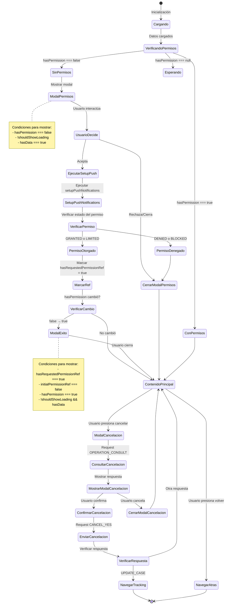
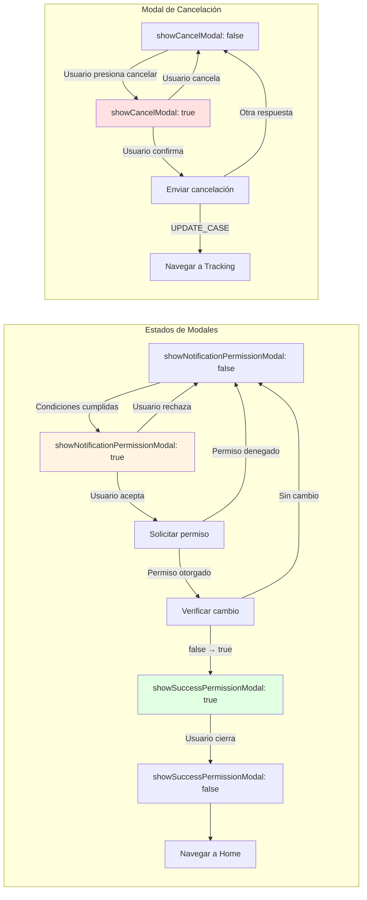
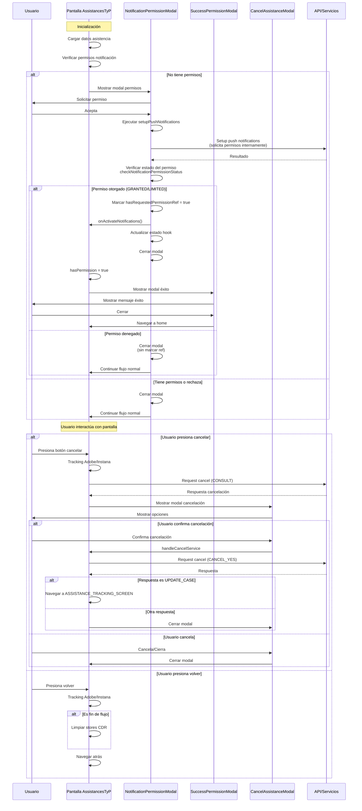

# Diagrama de Flujo - AssistancesTyP

## Flujo Principal de la Pantalla

## Flujo Detallado de Modales

## Diagrama de Estados de los Modales

## Secuencia de Interacciones

## Matriz de Estados y Condiciones

| Estado                | Condición para Mostrar                                                                                                                     | Acción del Usuario | Resultado                                                                                |
| --------------------- | ------------------------------------------------------------------------------------------------------------------------------------------ | ------------------ | ---------------------------------------------------------------------------------------- |
| **Modal Permisos**    | `hasPermission === false` `!shouldShowLoading` `hasData === true`                                                                  | Acepta             | Ejecuta setupPushNotifications → Verifica permiso → Si otorgado marca ref → Cierra modal |
| **Modal Permisos**    | Mismo                                                                                                                                      | Rechaza/Cierra     | Solo cierra modal                                                                        |
| **Modal Éxito**       | `hasRequestedPermissionRef === true` `initialPermissionRef === false` `hasPermission === true` `!shouldShowLoading && hasData` | Cierra             | Navega a home                                                                            |
| **Modal Cancelación** | Usuario presiona botón cancelar                                                                                                            | Confirma           | Envía cancelación → Si UPDATE_CASE navega a tracking                                     |
| **Modal Cancelación** | Mismo                                                                                                                                      | Cancela/Cierra     | Solo cierra modal                                                                        |
